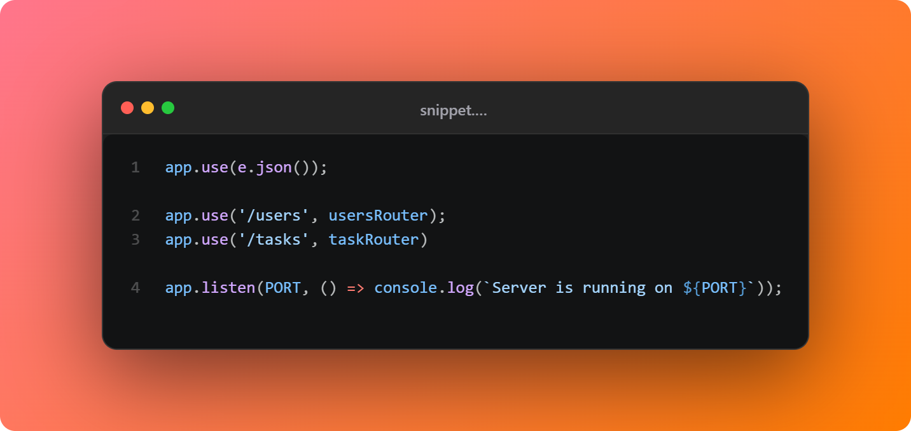

# SnippetShot 

SnippetShot is a VS Code extension that lets you turn code snippets into stunning shareable images instantly.

## Getting Started

1. Open SnippetShot: Command Palette `SnippetShot`
2. Selecting automatically copies and the panel listens for paste.
3. Paste (if needed): Click into the panel and press Ctrl+V.
4. Change background, toggle line numbers, set attribution text.
5. Click the "Save as PNG" button to export or use copy to clipboard.

## Contributing

We welcome contributions from the community! Please read our [Contributing Guidelines](doc/CONTRIBUTING.md) to learn how you can get involved.

## License

This project is licensed under the [MIT License](LICENSE).
